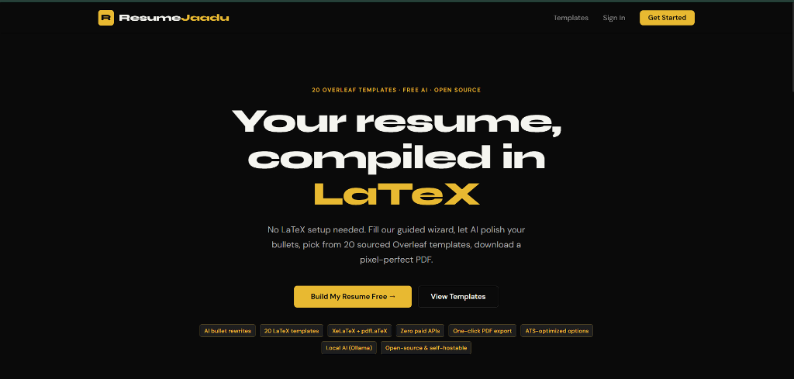
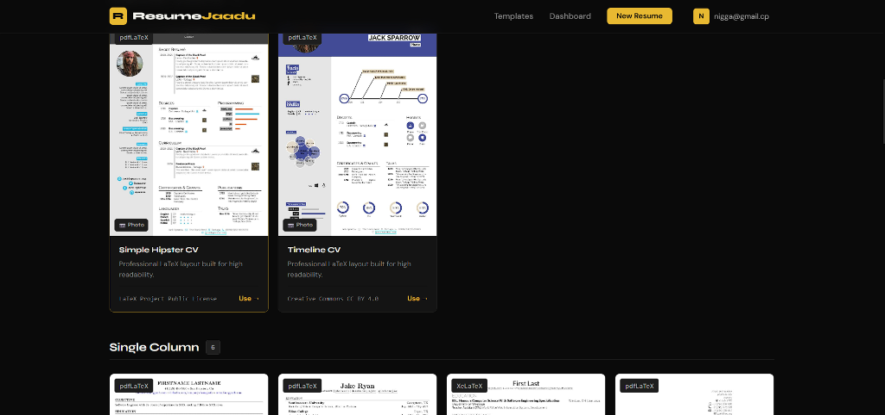
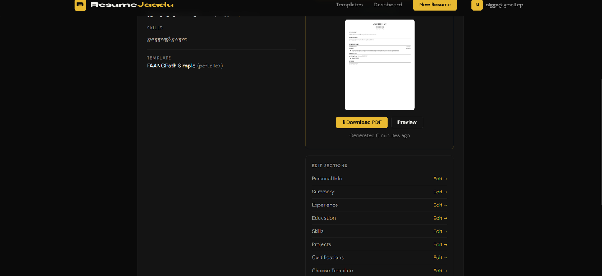

# ResumeJaadu 🪄

**AI-powered Django 5 resume builder with 20 LaTeX templates, Celery PDF compilation, and LiteLLM AI enhancement.**

[](https://python.org)
[](https://djangoproject.com)
[](https://docs.celeryq.dev)
[](https://redis.io)
[](https://tug.org/texlive)
[](LICENSE)

---

## ✨ Features

- **9-step resume wizard** — personal info, summary (AI-enhanced), experience + bullets (AI-enhanced), education, skills, projects, certifications, template gallery, review & download
- **20 LaTeX template stubs** — single-column, two-column/sidebar, academic, creative; swap in real `.tex.jinja` files anytime
- **AI Enhancement** — powered by [LiteLLM](https://docs.litellm.ai) (default: Groq `llama-3.1-70b-versatile`, zero-cost free tier). Swap to local Ollama in one env var.
- **Sandboxed PDF compilation** — Celery + TeX Live worker with subprocess timeout and log capture
- **HTMX-powered UI** — no page reloads; bullet improvement, AI suggestions, and PDF status polling are all HTMX
- **Dashboard** — manage multiple resumes with thumbnails, duplicate, delete
- **Rate limiting** — DB-backed 15 AI requests/min/user

---

## 📸 Visual Showcase

| 🏠 Landing Page | 🎨 Template Gallery | 📄 Live Review & PDF |
|:---:|:---:|:---:|
|  |  |  |
| **Dark Theme Landing Page**<br>No LaTeX setup needed, guided wizard | **20 Overleaf Templates**<br>Community gold standards & ATS clean | **Live Review Hub**<br>Section quick-links & instant PDF export |

---

## 🏗 Architecture

```
┌──────────────────────────────────────────────────────┐
│                  Django 5  (Web)                     │
│  allauth auth  ·  9-step wizard  ·  HTMX endpoints   │
└──────────┬───────────────────────┬───────────────────┘
           │  Celery tasks         │  AI requests
           ▼                       ▼
┌────────────────────┐   ┌──────────────────────────────┐
│  Redis (broker)    │   │  LiteLLM                     │
│  + result backend  │   │  → Groq free tier (default)  │
└────────┬───────────┘   │  → Ollama (local, offline)   │
         ▼               └──────────────────────────────┘
┌────────────────────┐
│  Celery Worker     │
│  TeX Live + pdflatex│
│  → compile PDF     │
│  → generate thumbnail│
└────────────────────┘
```

---

## 🚀 Quick Start (Docker)

```bash
# 1. Clone
git clone https://github.com/MeowMan007/Resumejaadu.git
cd Resumejaadu

# 2. Configure environment
cp .env.example .env
# Edit .env and set:
#   SECRET_KEY, AI_API_KEY (Groq key from console.groq.com)

# 3. Start all services
docker compose up --build

# 4. In another terminal — run migrations & sync templates
docker compose exec web python manage.py migrate
docker compose exec web python manage.py createsuperuser
docker compose exec web python manage.py sync_templates

# 5. Open http://localhost:8000
```

---

## 🛠 Local Dev (without Docker)

```bash
# Prerequisites: Python 3.11+, Redis

python -m venv .venv
.venv\Scripts\activate        # Windows
pip install -r requirements.txt

cp .env.example .env           # Edit as needed

python manage.py migrate
python manage.py createsuperuser
python manage.py sync_templates
python manage.py runserver
```

> **Note:** PDF generation won't work without TeX Live. Use Docker for full functionality.

---

## 🤖 AI Stack

| Mode | Model | Setup |
|------|-------|-------|
| Default (cloud) | `groq/llama-3.1-70b-versatile` | Set `AI_API_KEY` from [console.groq.com](https://console.groq.com) (free) |
| Local / offline | `ollama/qwen2.5:7b` | Set `AI_MODEL=ollama/qwen2.5:7b`, run Ollama locally |
| Any OpenAI-compat | `openai/gpt-4o-mini` etc. | Change `AI_MODEL` in `.env` |

Rate limit: **15 AI requests / minute / user** (DB-backed).

---

## 📁 Project Structure

```
Resumejaadu/
├── apps/
│   ├── accounts/           # django-allauth auth
│   ├── resumes/            # Resume models, wizard views, forms, admin
│   ├── templates_lib/      # ResumeTemplate model + sync_templates command
│   ├── ai_assistant/       # LiteLLM service, prompts, rate limiter, HTMX views
│   └── generator/          # Jinja2 env, latex_escape, compiler, Celery task
├── resume_templates/       # 20 LaTeX template folders (manifest + .tex.jinja)
├── scripts/
│   ├── ingest_template.py          # Ingest a single template into DB
│   └── compile_all_templates_smoke_test.py
├── templates/
│   ├── base.html
│   ├── landing.html
│   ├── dashboard/dashboard.html
│   └── resumes/
│       ├── wizard_base.html
│       ├── steps/          # 8 wizard step templates
│       └── partials/       # HTMX partials (pdf_status)
├── config/
│   ├── settings/           # base, dev, prod
│   ├── celery.py
│   └── urls.py
├── tests/
│   ├── test_latex_escape.py
│   ├── test_models.py
│   └── test_ai_service.py
├── docker-compose.yml
├── Dockerfile.web
└── Dockerfile.worker       # TeX Live + poppler-utils
```

---

## 🧪 Running Tests

```bash
python manage.py test tests/
```

- `test_latex_escape.py` — 14 tests, no external deps
- `test_models.py` — model CRUD, relationships, computed props
- `test_ai_service.py` — AI service with mocked LiteLLM (no API key needed)

---

## 🖨 Adding a Real LaTeX Template

1. Drop your `.tex.jinja` source into `resume_templates/<slug>/`
2. Make sure `manifest.json` is correct (see existing stubs for reference)
3. Run: `python manage.py sync_templates --slug <slug>`
4. Smoke-test: `python scripts/compile_all_templates_smoke_test.py`

---

## 🔒 Security Notes

- All wizard/AI endpoints require authentication (`@login_required` / `LoginRequiredMixin`)
- Object-level ownership checked on every resume access (`_assert_owns_resume`)
- CSRF enforced on all HTMX `hx-post` endpoints
- Photo uploads re-encoded through Pillow (strips EXIF, validates format/size)
- AI rate limiter prevents abuse (15 req/min/user, DB-backed)
- LaTeX compilation runs in isolated tempdir with timeout

---

## 📜 License

MIT © 2026 [MeowMan007](https://github.com/MeowMan007)
